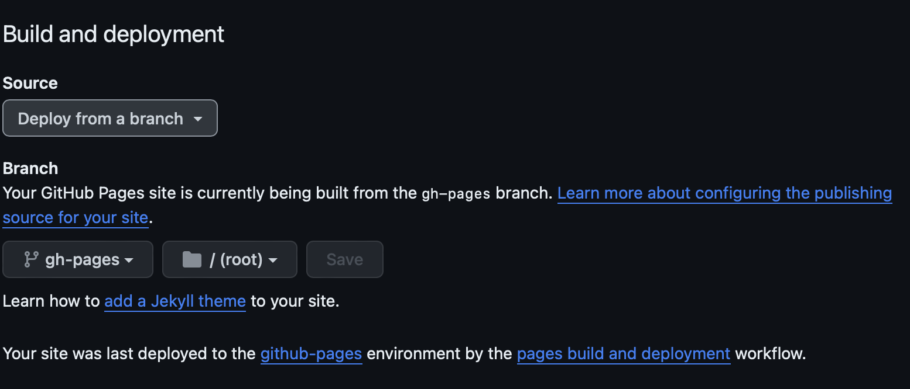
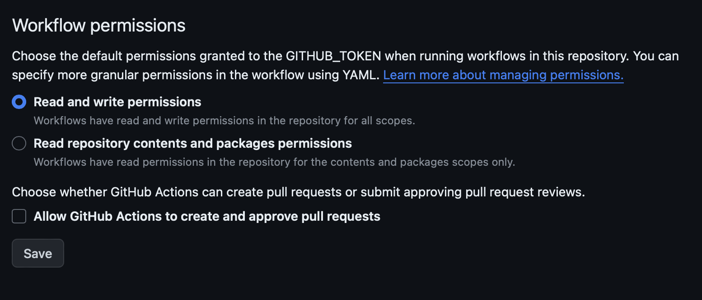

# Allure Example

## How to configure GitHub pages

* setup empty gh-pages branch in existing repository: https://gist.github.com/ramnathv/2227408
* go to `Settings > Pages` repository page
  
* go to `Settings > Actions > General` repository page
  

## How to build report with history

[GitHub Workflow](.github/workflows/build.yml)

* copy history from previous build
  ```
  - name: Copy History
    uses: actions/checkout@v2
    if: always()
    with:
      ref: gh-pages
      path: gh-pages
  ```
* generate allure report with history 
  ```
  - name: Build Report
    uses: simple-elf/allure-report-action@v1.7
    if: always()
    with:
      allure_results: build/allure-results
      allure_history: allure-history
      keep_reports: 20
  ```
* push history to next builds
  ```
  - name: Publish Report
    if: always()
    uses: peaceiris/actions-gh-pages@v2
    env:
      PERSONAL_TOKEN: ${{ secrets.GITHUB_TOKEN }}
      PUBLISH_BRANCH: gh-pages
      PUBLISH_DIR: allure-history
  ```